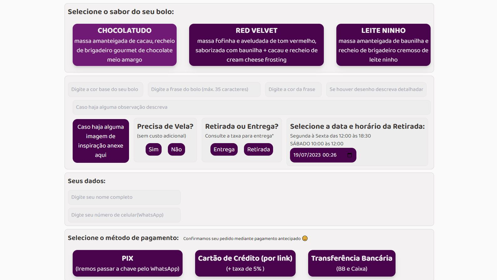

# Sales Orders For Trello (Aplicação que cria cards dentro do Trello)

## Capa
 <br/> <br/>

## Design da aplicação
- Clique [aqui](https://www.figma.com/file/CNZBZZ2sJhnC1vlCuyGkg8/Pedido-Bent%C3%B4-Cake?node-id=2%3A2) para acessar o layout no Figma

## Funcionalidades da aplicação
- Colher informações do cliente e infomrações referente ao pedido
- Mostrar que o pedido foi confitmado com suacesso
- Enviar informações tratadas para o trello

## Tecnologias utilizadas
- Vite
- React
- Typescript
- Styled components
- React hook form
- Moment
- uuid
- yup
- Zod

## Como executar a aplicação 

### Instalação
1. Clone o repositório
```bash
git clone https://github.com/Magon0/SalesOrdesForTrello
```
2. Acesse a pasta do projeto
```bash
cd SalesOrdesForTrello
```
3. Instale as dependências necessárias 
```bash
npm install
```
4. Execute o projeto
```bash
npm run dev
```
